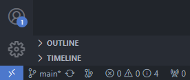
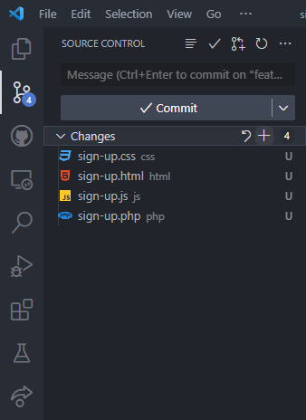
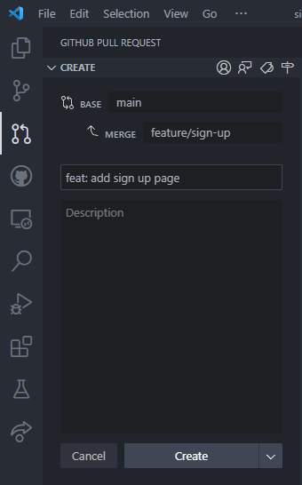

# GitHub in VS Code

- [1. Initial setup](#1-initial-setup)
  - [1.1. Prerequisites](#11-prerequisites)
  - [1.2. Accept collaboration invitation](#12-accept-collaboration-invitation)
  - [1.3. Clone repository to local folder](#13-clone-repository-to-local-folder)
- [2. Rinse and repeat workflow](#2-rinse-and-repeat-workflow)
  - [2.1. Open cloned repository](#21-open-cloned-repository)
  - [2.2. Create a feature branch](#22-create-a-feature-branch)
  - [2.3. Make changes on feature branch](#23-make-changes-on-feature-branch)
  - [2.4. Push feature branch to main branch](#24-push-feature-branch-to-main-branch)
  - [2.5. Delete local branch after feature is approved](#25-delete-local-branch-after-feature-is-approved)
- [3. References](#3-references)

## 1. Initial setup

### 1.1. Prerequisites

<ol>
  <li>Create <a href="https://github.com/">GitHub</a> account</li>
  <li>Install <a href="https://git-scm.com/downloads">Git</a></li>
  <li>Install <a href="https://code.visualstudio.com/">VS Code Stable</a></li>
  <li>
    Install
    <a href="vscode:extension/GitHub.vscode-pull-request-github"
      >GitHub Pull Requests and Issues VS Code extension</a
    >
  </li>
  <li>Receive invitation to be added as collaborator of a repository</li>
</ol>

### 1.2. Accept collaboration invitation

  <li>Open browser</li>
  <li>Open <code>https://github.com/username/repo-name</code></li>
  <li>Accept invitation to be added as collaborator of the repository</li>
</ol>

### 1.3. Clone repository to local folder

<ol>
  <li>Open VS Code</li>
  <li>Open Command Palette <code>Ctrl+Shift+P</code></li>

  <li>Type <code>git clone</code> and hit <code>enter</code></li>
  

  <li>Select <code>Clone from GitHub</code></li>
  

  <li>Type <code>username/repository-name</code></li>
  
  <li>
    Click <code>Allow</code> if
    <code>The extension 'GitHub' wants to sign in using GitHub.</code>
  </li>
  <li>Sign in with your GitHub account</li>
  <li>Select location to store repository</li>
  <li>You have successfully cloned an online repository to local desktop!</li>
</ol>

## 2. Rinse and repeat workflow

### 2.1. Open cloned repository

<ol>
  <li>Open VS Code</li>

  <li>Select <code>File</code> on top left corner</li>
  

  <li>Select <code>Open Folder...</code></li>
  <li>Select location of stored repository</li>
</ol>

### 2.2. Create a feature branch

<ol>
  <li>Make sure you are in branch <code>main</code> on bottom left corner</li>
  

  <li>
    Click Sync Branch button on right side of <code>main</code> (cycle arrow
    icon)
  </li>
  

  <li>Click branch <code>main</code> on bottom left corner</li>

  <li>Select <code>Create new branch...</code></li>
  

  <li>Type <code>feature/feature-name</code> and hit <code>enter</code></li>
  

  <li>
    Click Publish Branch button on bottom left corner and right side of
    <code>feature/feature-name</code> (cloud arrow icon)
  </li>
  

  <li>
    Click <code>Close</code> button if
    <code
      >Would you like to create a Pull Request for branch
      'feature/feature-name?'</code
    >
    pops up
  </li>
  

  <li>You have successfully created a feature branch!</li>
</ol>

### 2.3. Make changes on feature branch

<ol>
  <li>
    Make sure you are in branch <code>feature/feature-name</code> on bottom left
    corner
  </li>
  
  <li>Make changes (create, edit, delete files)</li>
</ol>

### 2.4. Push feature branch to main branch

<ol>
  <li>Only push feature branch when your task is complete</li>

  <li>
    Make sure you are in branch <code>feature/feature-name</code> on bottom left
    corner
  </li>
  

  <li>Click source control on left sidebar or <code>Ctrl+Shift+G</code></li>
  

  <li>
    Hover <code>Changes</code> and click <code>+</code> Stage All Changes button
  </li>
  

  <li>
    Click <code>Message</code> input box above <code>/ Commit</code> button
  </li>
  <li>Type <code>feat: add feature-name</code></li>
  

  <li>
    <code>COMMIT_EDITMSG</code> will open if you skip step 6. Close
    <code>COMMIT_EDITMSG</code> and do step 6.
  </li>
  

  <li>Click <code>/ Commit</code> button</li>

  <li>Click <code>Sync Changes</code> button</li>
  

  <li>Click GitHub on left sidebar</li>
  

  <li>
    Hover <code>PULL REQUESTS</code> and click
    <code>Create Pull Request</code> button (plus arrow dot icon)
  </li>
  

  <li>
    Make sure <code>base</code> is <code>main</code> and <code>merge</code> is
    <code>feature/feature-name</code>
  </li>
  

  <li>Click <code>Create</code></li>

  <li>
    You have successfully requested to push feature branch to main branch!
  </li>
  
</ol>

### 2.5. Delete local branch after feature is approved

<ol>
  <li>Make sure you are in branch <code>main</code> on bottom left corner</li>
  

  <li>Open Command Palette <code>Ctrl+Shift+P</code></li>

  <li>Type <code>git delete branch</code> and hit <code>enter</code></li>
  

  <li>Select <code>feature/feature-name</code> that has been approved</li>
  
</ol>

<b>Congratulations. You are now a GitHub collaborator!</b>

## 3. References

<ol>
  <li>
    <a href="https://code.visualstudio.com/docs/sourcecontrol/intro-to-git">
      Introduction to Git in VS Code
    </a>
  </li>
  <li>
    <a href="https://code.visualstudio.com/docs/sourcecontrol/github">
      Working with GitHub in VS Code
    </a>
  </li>
</ol>
