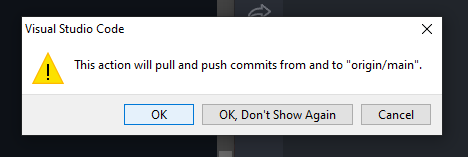
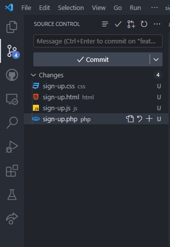
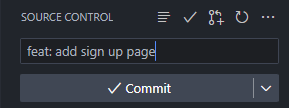
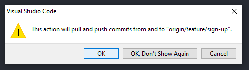

<h1>GitHub in VS Code</h1>

<h2>Setup</h2>

<h3>Prerequisites</h3>
<ol>
  <li>Create <a href="https://github.com/">GitHub</a> account</li>
  <li>Install <a href="https://git-scm.com/downloads">Git</a></li>
  <li>Install <a href="https://code.visualstudio.com/">VS Code Stable</a></li>
  <li>
    Install
    <a href="vscode:extension/GitHub.vscode-pull-request-github"
      >GitHub Pull Requests and Issues VS Code extension</a
    >
  </li>
  <li>Receive invitation to be added as collaborator of a repository</li>
</ol>

<h3>Accept collaboration invitation</h3>
<ol>
  <li>Open browser</li>
  <li>Open <code>https://github.com/username/repo-name</code></li>
  <li>Accept invitation to be added as collaborator of the repository</li>
</ol>

<h3>Clone repository to local folder</h3>
<ol>
  <li>Open VS Code</li>
  <li>Open Command Palette <code>Ctrl+Shift+P</code></li>
  <li>Type <code>git clone</code> and hit <code>enter</code></li>
  
  <li>Select <code>Clone from GitHub</code></li>
  <li>Type <code>username/repository-name</code></li>
  
  <li>
    Click <code>Allow</code> if
    <code>The extension 'GitHub' wants to sign in using GitHub.</code> (else
    skip step 6 and 7)
  </li>
  <li>Sign in with your GitHub account</li>
  <li>Select location to store repository</li>
  <li>You have successfully cloned an online repository to local desktop!</l>
</ol>

<h2>Rinse and repeat workflow</h2>

<h3>Open cloned repository</h3>
<ol>
  <li>Open VS Code</li>
  <li>Select <code>File</code> on top left corner</li>
  <li>Select <code>Open Folder...</code></li>
  
  <li>Select location of stored repository</li>
</ol>

<h3>Create a feature branch</h3>
<ol>
  <li>Make sure you are in branch <code>main</code> on bottom left corner</li>
  
  <li>Click Sync Branch button on right side of <code>main</code> (cycle arrow icon)</li>
  <li>
    Click <code>OK</code> if
    <code
      >This action will pull and push commits from and to "origin/main"</code
    >
    (else skip this step)
  </li>
  
  <li>Click <code>main</code> branch on bottom left corner</li>

  <li>Select <code>Create new branch...</code></li>
  
  <li>Type <code>feature/feature-name</code> and hit <code>enter</code></li>
  
  <li>
    Click Publish Branch button on bottom left corner and right side of
    <code>feature/feature-name</code> (cloud with arrow icon) 
  </li>
  
  <li>Click <code>Close</code> button if <code>Would you like to create a Pull Request for branch 'feature/feature-name?'</code> (else skip this step)</li>
  
  <li>You have successfully created a feature branch!</li>
</ol>

<h3>Make changes on feature branch</h3>
<ol>
  <li>
    Make sure you are in branch <code>feature/feature-name</code> on bottom left
    corner
  </li>
  
  <li>Make changes (create, edit, delete files)</li>
</ol>

<h3>Push feature branch to main branch</h3>
<ol>
  <li>Only push feature branch when your feature is complete</li>
  <li>
    Make sure you are in branch <code>feature/feature-name</code> on bottom left
    corner
  </li>
  
  <li>Click source control on left sidebar or <code>Ctrl+Shift+G</code></li>
  
  <li>
    Hover <code>Changes</code> and click <code>+</code> Stage All Changes button
  </li>
  
  <li>
    Click <code>Message</code> input box above <code>/ Commit</code> button
  </li>
  <li>Type <code>feat: add feature-name</code></li>
  
  <li><code>COMMIT_EDITMSG</code> will open if you skip step 6. Close <code>COMMIT_EDITMSG</code> and do step 6. (else skip this)</li>
  
  <li>Click <code>/ Commit</code> button</li>
  <li>Click <code>Sync Changes</code> button</li>
  
  <li>Click <code>OK</code> if <code>This action will pull and push commits from and to "origin/feature/feature-name"</code>(else skip this step)</li>
  
  <li>Click GitHub on left sidebar</li>
  
  <li>Hover <code>PULL REQUESTS</code></li>
  <li>Click <code>Create Pull Request</code> button (plus arrow dot icon)</li>
  <li>
    Make sure <code>base</code> is <code>main</code> and <code>merge</code> is
    <code>feature/feature-name</code>
  </li>
  
  <li>Click <code>Create</code></li>
  <li>You have successfully pushed a feature branch to main branch!</li>
  
</ol>

<h3>Delete local branch after feature is approved</h3>
<ol>
  <li>Open Command Palette <code>Ctrl+Shift+P</code></li>
  <li>Type <code>git delete branch</code> and hit <code>enter</code></li>
  <li>Select <code>feature/feature-name</code> that has been approved</li>
</ol>

<h4>Congratulations. You are now a GitHub collaborator!</h4>

<h2>References</h2>
<ol>
  <li>
    <a href="https://code.visualstudio.com/docs/sourcecontrol/intro-to-git">
      Introduction to Git in VS Code
    </a>
  </li>
  <li>
    <a href="https://code.visualstudio.com/docs/sourcecontrol/github">
      Working with GitHub in VS Code
    </a>
  </li>
</ol>
